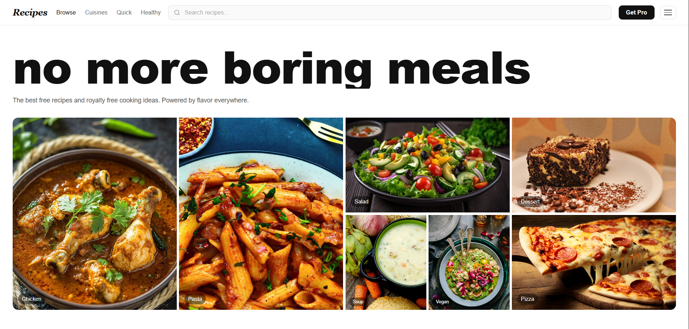

# 🍽️ RecipeFinder (React)

A modern and responsive **Recipe Finder App** built using **React** and the **Spoonacular API**.  
This project demonstrates **API integration, dynamic search, recipe detail pages, dark mode, skeleton loading states, and component-based architecture** in a real-world React application.

---

🌐 **Live Demo:** [recipes-finder-webapp.netlify.app](https://recipes-finder-webapp.netlify.app/)

---

## 📸 Screenshot



---

## 🚀 Features

* 🔍 **Smart Search** — Debounced live search across thousands of recipes
* 🏠 **Landing Home Page** — Hero grid, feature cards, cuisine filters, quick picks, testimonials, and footer
* 📋 **Recipe Dashboard** — Grid of recipe cards with health scores, cost in INR, cook time, and dietary tags
* 📄 **Recipe Detail Page** — Full ingredient list, nutrition scores, dietary tags, and source links
* 🌙 **Dark Mode** — Persistent dark/light toggle via the navbar menu
* ⏳ **Loading & Error States** — Spinner while fetching, graceful error and empty-state handling
* 💸 **Price in INR** — Price-per-serving auto-converted from USD to ₹
* 🏷️ **Dietary Tags** — Gluten Free, Dairy Free, Vegan, Vegetarian, Very Healthy, Budget
* 📱 **Fully Responsive** — Works across mobile, tablet, and desktop

---

## 🛠️ Technologies Used

* React
* JavaScript (ES6+)
* Tailwind CSS
* HTML5
* Spoonacular API (`spoonacular.com`)
* Vite (build tool)

---

## 📂 Project Structure

```
RecipeFinder/
│
├── public/
│   └── Recipies.png
│   └── chicken.jpg
│   └── pasta.jpg
│   └── salad.jpg
│   └── desert.JPG
│   └── soup.jpg
│   └── vegan.jpg
│   └── pizza.jpg
│
├── src/
│   ├── components/
│   │   ├── Api.jsx           ← Spoonacular API fetching logic
│   │   ├── Dashboard.jsx     ← Recipe search results grid
│   │   ├── Food_Page.jsx     ← Individual recipe detail view
│   │   └── Home.jsx          ← Landing page + Navbar
│   │
│   ├── App.jsx               ← Root component & routing state
│   └── main.jsx
│
├── .env
├── index.html
└── package.json
```

---

## ▶️ Run the Project

```bash
npm install
npm run dev
```

---

## 🔑 Environment Variables

Create a `.env` file in the root of your project and add your Spoonacular API key:

```
VITE_SPOONACULAR_API_KEY=your_api_key_here
```

Get your free API key at [https://spoonacular.com/food-api](https://spoonacular.com/food-api)

---

## 💡 Key Concepts Used

* React Hooks (**useState, useEffect, useRef, useCallback**)
* Async/Await & Fetch API
* Environment Variables with **Vite (`import.meta.env`)**
* Debounced Search Input
* Conditional Rendering & Error Handling
* Component-based Architecture
* Dark Mode Toggle via State
* Responsive Grid Layouts with Tailwind CSS
* `dangerouslySetInnerHTML` for API-provided HTML summaries

---

## 🧩 Component Overview

| Component | Responsibility |
|-----------|---------------|
| `App.jsx` | Global state (search, selected food, dark mode), renders correct view |
| `Api.jsx` | Fetches recipes from Spoonacular on search change, handles errors |
| `Home.jsx` + `Navbar` | Landing page with hero grid, filters, cuisines, reviews, footer |
| `Dashboard.jsx` | Displays search results as a responsive card grid |
| `Food_Page.jsx` | Full recipe detail: image, stats, ingredients, source links |

---

## 👨‍💻 Author

**Sachin**  
[https://github.com/sachin-codes01](https://github.com/sachin-codes01)